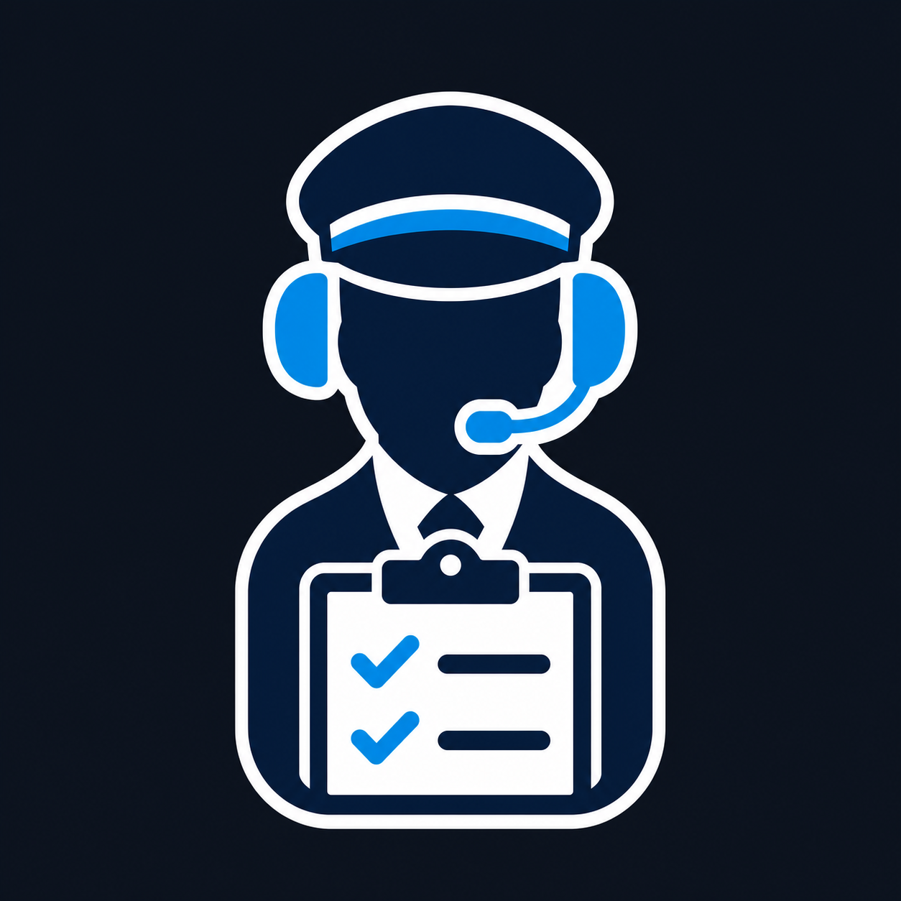

# FSChecklist



Assistente de checklist por voz para o Microsoft Flight Simulator 2024.

O FSChecklist reproduz o fluxo *challenge and response*: o copiloto lê cada
item, o piloto responde pelo microfone e o aplicativo avança quando a resposta
corresponde à configuração da checklist.

> Este projeto é destinado exclusivamente à simulação. Não use em operações
> aeronáuticas reais.

## Recursos

- callouts e reconhecimento de voz em português do Brasil;
- checklists controladas por arquivos JSON;
- atalho global `F9`, inclusive com o simulador em primeiro plano;
- lista visual com itens pendentes, atual e concluídos;
- confirmação manual de um item;
- processamento de voz local no computador;
- suporte a checklists de diferentes aeronaves.

## Baixar e instalar

### Versão pronta

1. Acesse a página de
   [Releases](https://github.com/joaopedroffranco/FSChecklist/releases).
2. Abra a versão mais recente.
3. Em **Assets**, baixe o arquivo disponibilizado para Windows.
4. Se o download for um `.zip`, extraia todo o conteúdo para uma pasta.
5. Execute `FSChecklist.exe`.

Mantenha a pasta `checklists` ao lado do executável. Se o Windows exibir o
SmartScreen, confira se o arquivo foi baixado deste repositório antes de
selecionar **Mais informações → Executar assim mesmo**.

Se a página de Releases ainda não tiver uma versão pronta, use as instruções de
[compilação](#compilar-a-partir-do-código-fonte).

## Requisitos

- Windows 10 ou 11 de 64 bits;
- microfone configurado como dispositivo de entrada;
- pacote de fala **Português (Brasil)** instalado no Windows;
- [.NET 8 Desktop Runtime](https://dotnet.microsoft.com/download/dotnet/8.0)
  caso o Windows solicite.

O Microsoft Flight Simulator não precisa estar aberto para testar o aplicativo.

## Configurar o reconhecimento de voz

No Windows 11:

1. Abra **Configurações → Hora e idioma → Idioma e região**.
2. Adicione **Português (Brasil)** e instale o recurso de fala.
3. Abra **Configurações → Privacidade e segurança → Microfone**.
4. Permita o acesso ao microfone para aplicativos da área de trabalho.
5. Em **Privacidade e segurança → Fala**, habilite o reconhecimento de fala.

Os nomes dessas telas podem variar ligeiramente no Windows 10.

## Como usar

1. Abra `FSChecklist.exe`.
2. Escolha a aeronave e a checklist.
3. Clique em **INICIAR** ou pressione `F9`.
4. Aguarde o copiloto ler o item.
5. Responda ao callout pelo microfone.
6. Acompanhe o progresso na lista central.

O microfone permanece ativo durante a execução da checklist. A voz do copiloto
é ignorada enquanto o callout está sendo reproduzido.

Controles disponíveis:

- **✓ — Forçar check:** confirma manualmente o item atual;
- **■ — Terminar:** interrompe a checklist sem confirmar os itens restantes.

Uma resposta ausente, incerta ou diferente do JSON mantém o item pendente.

## Solução de problemas

### O microfone não reconhece minha voz

- confirme que o microfone correto é o dispositivo padrão do Windows;
- verifique a permissão para aplicativos da área de trabalho;
- instale o pacote de fala Português (Brasil);
- fale somente depois que o status indicar que o microfone está ouvindo.

### O F9 não funciona

- verifique se a interface informa que o `F9 global` está ativo;
- feche outro aplicativo que esteja bloqueando a tecla;
- use o botão **INICIAR** como alternativa.

### O aplicativo não abre

- extraia o `.zip` antes de executar;
- instale o .NET 8 Desktop Runtime;
- não remova a pasta `checklists`;
- abra uma issue com uma captura de tela e a mensagem de erro.

## Adicionar checklists

Coloque arquivos `.json` na pasta `checklists`. A sequência e o conteúdo dos
itens são definidos exclusivamente pelo arquivo: o aplicativo não inventa,
reordena ou pula etapas usando IA.

Checklist que aceita qualquer resposta reconhecida:

```json
{
  "aircraft": "Fenix A320",
  "rules": { "acceptAnyAnswer": true },
  "checklists": [
    {
      "id": "before_start",
      "name": "Before Start",
      "items": ["Parking Brake", "Navi Lights"]
    }
  ]
}
```

Checklist com respostas específicas:

```json
{
  "schemaVersion": 1,
  "aircraft": "B777",
  "language": "pt-BR",
  "checklists": [
    {
      "id": "before-start",
      "name": "Before Start",
      "completedCallout": "Before start checklist complete",
      "items": [
        {
          "id": "parking-brake",
          "callout": "Parking brake",
          "responses": ["set", "acionado"]
        }
      ]
    }
  ]
}
```

Use `checklists/a320.json` como exemplo completo.

## Compilar a partir do código-fonte

Requisitos para desenvolvimento:

- [Git](https://git-scm.com/);
- [.NET 8 SDK](https://dotnet.microsoft.com/download/dotnet/8.0);
- Windows 10 ou 11 de 64 bits.

Clone e publique o projeto:

```powershell
git clone https://github.com/joaopedroffranco/FSChecklist.git
cd FSChecklist
dotnet restore .\src\FSChecklist.csproj --configfile .\NuGet.Config
dotnet publish .\src\FSChecklist.csproj `
  --configuration Release `
  --runtime win-x64 `
  --self-contained false `
  --output .\dist
New-Item .\dist\checklists -ItemType Directory -Force
Copy-Item .\checklists\*.json .\dist\checklists -Force
```

O executável será criado em `dist\FSChecklist.exe`.

O script `build.ps1` é o fluxo de distribuição do mantenedor. Ele também assina
o executável e, por isso, exige Windows SDK e um certificado local
`CN=FSChecklist Local`.

## Privacidade e segurança

- o áudio é processado localmente pelo mecanismo de fala do Windows;
- respostas não reconhecidas não avançam a checklist;
- a tela mostra o item atual e o progresso;
- o conteúdo executado vem dos arquivos JSON;
- o aplicativo não substitui procedimentos ou documentação aeronáutica oficial.

## Contribuir

Issues e pull requests são bem-vindos. Ao relatar um problema, informe:

- versão do Windows;
- aeronave e checklist utilizadas;
- mensagem de erro;
- passos para reproduzir;
- captura de tela, quando possível.
